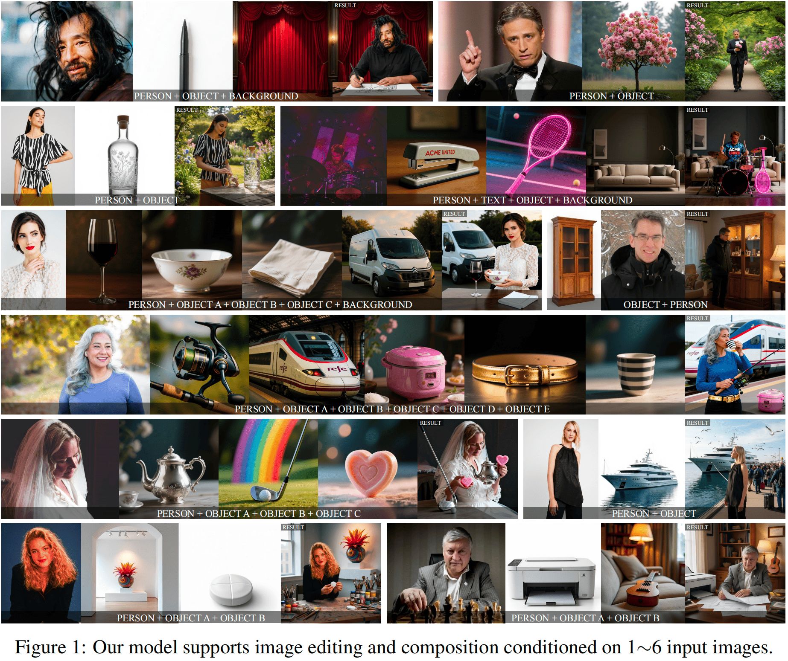

<h1 align="center">Skywork-UniPic</h1>

  Unified multimodal model for image editing, generation, and understanding

## 📝 Overview

Welcome to the **Skywork-UniPic** repository!  
This repository hosts the **model weights** and **official implementations** of unipic unified multimodal series, featuring three distinct modeling paradigms:

- **UniPic-3 ([README](https://github.com/SkyworkAI/UniPic/tree/main/UniPic-3))** — 🔥 **Open-source SOTA Multi-Image Editing Model**. Unified framework for single-image editing & multi-image composition. Supports **1–6 input images** with flexible resolutions. **8-step inference** with **12.5× speedup** via CM + DMD distillation.

  

    
  

- **UniPic-2([README](https://github.com/SkyworkAI/UniPic/tree/main/UniPic-2))** — **SD3.5M-Kontext** and **MetaQuery** variants based on Efficient Architectures with Diffusion Post-Training, delivering state-of-the-art performance in text-to-image generation, fine-grained image editing, and multimodal reasoning.

  

    
  

- **UniPic-1([README](https://github.com/SkyworkAI/UniPic/tree/main/UniPic-1))** — **1.5B parameters**, **Unified Autoregressive Modeling** for joint visual understanding and generation, enabling a single transformer to handle both perception and synthesis tasks.  

---
## 🔥 Latest News

| Date       | Update |
|------------|--------|
| **2026-01-09** | Released **UniPic-3** — 🔥 Open-source SOTA multi-image editing model. Support single & multi-image editing, 1–6 inputs, **8-step / 12.5× faster** inference    |
| **2025-08-13** | Released **UniPic-2** — Unified Model Weights with Diffusion-based Post-Training     |
| **2025-07-30** | Released **UniPic-1** — Autoregressive unified modeling from scratch     |
---
## ✨ Key Features
 
- 🎨 **Text-to-Image Generation** — High-fidelity synthesis from natural language prompts.  
- 🛠 **Image Editing** — Seamless inpainting, outpainting, and object manipulation.
- 🖼 **Image Understanding** — Robust perception capabilities for various visual tasks. 
- ⚡ **Efficient Architecture** — Optimized for both accuracy and deployability.  
---
## 📜 License

This project is licensed under the **MIT License** — see the [LICENSE](LICENSE) file for details.

---

